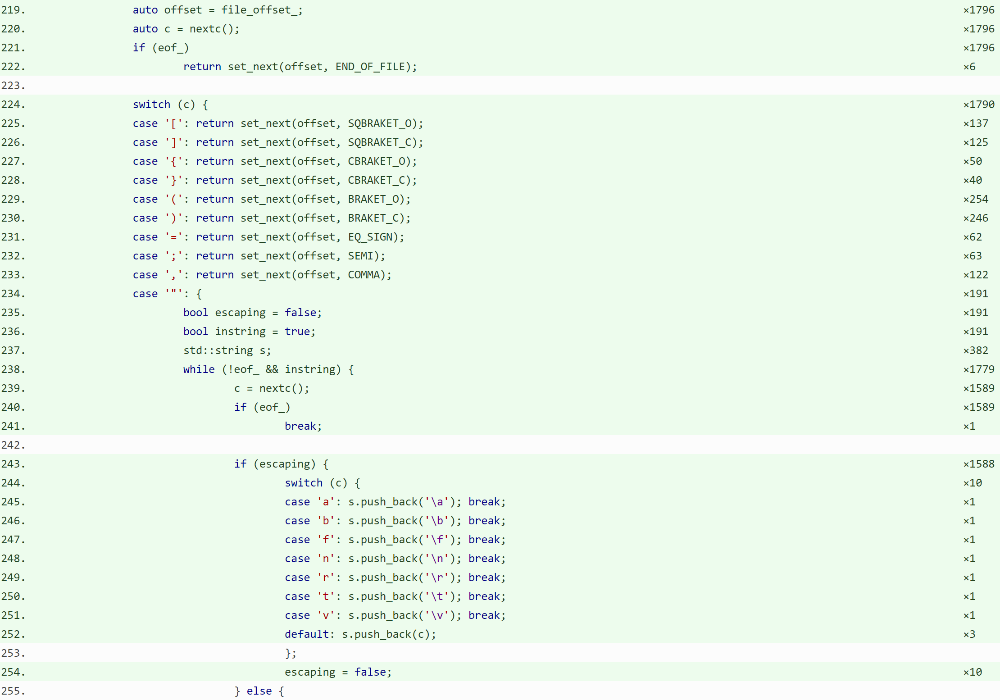

# Description from registration

> Probably a voice against type composition and in favor of inheritance, I think...
>
> I attempted to create a tokenizer, inspired by Spirit X3, to be able to highlight C++ blocks. By the time I arrived at the topmost type ("preprocessing-file: group(opt)"), its name was so long, one compiler was unable to fit it in memory and ~~flat out crashed on that~~ refused to recognize `constexpr` on any later expression.
>
> After breaking the composition with inheritance, the compilers take 10-15 seconds to produce the object file.

# Presentation

> As a side effect of me trying to understand how `gcov` counter from various object files interact, I worked on a tool generating coverage report, in C++, and one of the things I wanted to have was some highlighting of the source code.

### slide:


> Normally this is done by JS on the client-side, but in this particular case I wanted the resulting files to be static, so no scripting. I wanted:

## Plan
1. C++ highlighter in C++ itself
2. Only a category (color) and start/end indexes, no copies
3. Fast. As fast as possible. Maybe even faster.

> This seemed to be a big task, but only in terms of code needed to implement key parts of _Lexical conventions_ (`[lex]`) and _Preprocessing directives_ (`[cpp]`) chapters of the standard. (for instance, I didn't really need preprocessor groups for simple highlighting).
> I would use Boost.Spirit to transpose things like:

## Random sample rule

```
header-name:
    < h-char-sequence >
    " q-char-sequence "
```

> to something, like:

## Boost.Spirit

```cpp
auto header_name = 
    ('<' >> h_char_sequence >> '>')
    | ('"' >> q_char_sequence >> '"')
    ;
```

> And then I thought to myself 

## Learning is good...


## Learning is good...
1. This is a great learning opportunity
2. If I also write the templates, I could see, how all this works together
3. Besides, I can try to _`constexpr` all the things!_ and see where this leads me...
   

> So, instead of using Spirit as provided, I made a simplified version of Spirit X3 and started to write things like

## Spirit-inspired homegrown template programming

```cpp
constexpr auto header_name = 
    ('<' >> +(any - eol - '>') >> '>')     [on_system_header]
    | ('"' >> +(any - eol - '"') >> '"')   [on_local_header]
    ;
```

> Where the actions in square brackets registered specific color categories for the ranges they should span (here, either a `system_header` or a `local_header`).

## Spirit-inspired homegrown template programming

```cpp
constexpr auto header_name = 
    ('<' >> +(any - eol - '>') >> '>')     [on_system_header]
    | ('"' >> +(any - eol - '"') >> '"')   [on_local_header]
    ;
```

- 456 bytes (MS ABI)
- 218 bytes (Intel ABI)

> If I stopped at this moment and think, I would probably be a little worried. The type name of the `header_name` is either 456 characters when compiled with MSVC, or 218, when Intel ABI is used. Just for rule describing header name. By the time I arrived at `control_line`

## `control-line` fiasco

```cpp
constexpr auto pp_control =
    pp_include
    | pp_define
    | pp_undef
    | pp_ifdef
    | pp_ifndef
    | pp_if
    | ("elif"_pp_ident >> mSP >> constant_expression)
    | "else"_pp_ident >> SP
    | "endif"_pp_ident >> SP
    | ("line"_pp_ident >> mSP >> +(preprocessing_token >> SP))
    | ("error"_pp_ident >> opt_pp_tokens)
    | ("pragma"_pp_ident >> opt_pp_tokens)
    | opt_pp_tokens
    ;

constexpr auto control_line =
    (ch('#') >> SP >> pp_control) [on_control_line]
    ;
```

> one compiler decided nothing in the file starting with `control_line` is worthy of being `constexpr`, so it declined every declaration from this point onward.

## Side note
Expression-only `control_line` since then:
- 37 bytes (MS ABI, a hash of some sorts)
- 2236 bytes (Intel ABI)

> Since then, I changed all the compilers I care about, so now the "pure expression" approach to the `control_line` is the 2236 characters with Intel ABI and a 37-character hash with VS2019.

## Back to last year: workarounds

1. `static constexpr` grammar member in a class with _much_ shorter name.
2. Inherit from a lambda returning reference to a grammar (think `wrapped<MAGIC>` instead of full name). 

> I tried to shorten the length of the type with two tricks. One was putting the grammar as a `constexpr static` member and writing the parse method as a proxy to that grammar, the other was to wrap template around a lambda and use the `static` "local" to hide the complicated bits.

## Stats

_Machine: i7-4790K, Windows 10 with Ubuntu 18.04 from WSL_

- **2017** `cl 15.9.11`
- **2019** `cl 16.3.0 Preview 2`
- **GCC**  `g++-8 (Ubuntu 8.3.0-6ubuntu1~18.04.1) 8.3.0`

| Method             | Compiler | `control_line` [<sup>1</sup>](#1) | `preprocessing_file` <sup>[1](#1), [2](#2)</sup> | compilation time [s] |
|--------------------|----------|-----:|------:|---:|
| expressions-only   | 2017     | -    | -     | 61 |
| &nbsp;             | 2019     | 37   | 37    | 15 |
| &nbsp;             | GCC      | 2236 | 2345  | 5  |


| Method             | Compiler | `control_line` | `preprocessing_file` | compilation time [s] |
|--------------------|----------|-----:|------:|---:|
| `shorten_typename` | 2017     | 851  | 15201 | 31 |
| &nbsp;             | 2019     | 851  | 37    | 12 |
| &nbsp;             | GCC      | 503  | 1482  | 5  |


| Method             | Compiler | `control_line` | `preprocessing_file` | compilation time [s] |
|--------------------|----------|-----:|------:|---:|
| `wrapped<>`        | 2017     | 889  | 15315 | 22 |
| &nbsp;             | 2019     | 872  | 37    | 22 |
| &nbsp;             | GCC      | 505  | 1484  | 5  |

<a class="anchor" id="1"><sup>1</sup></a> Either `strlen(typeid(T).name())` or `strlen(typeid(T).raw_name())`, the latter from `cl`.<br/>
<a class="anchor" id="2"><sup>2</sup></a> `preprocessing_file` is the top-level grammar object.
 
## What I learned:

1. With template programming, it's unexpectedly easy to test the boundaries of your compiler.
2. If you happen to trip your compiler, there are probably ways to work around it.
3. When you (not the compiler) start obsessing about singular thing, don't forget about rest of the project.
   - The `sizeof(preprocessing_file)` in "pure expressions" case is well above 50kiB (65 from MSVC 2019, 90 from GCC)
   - Kill me now...

## Thank you
